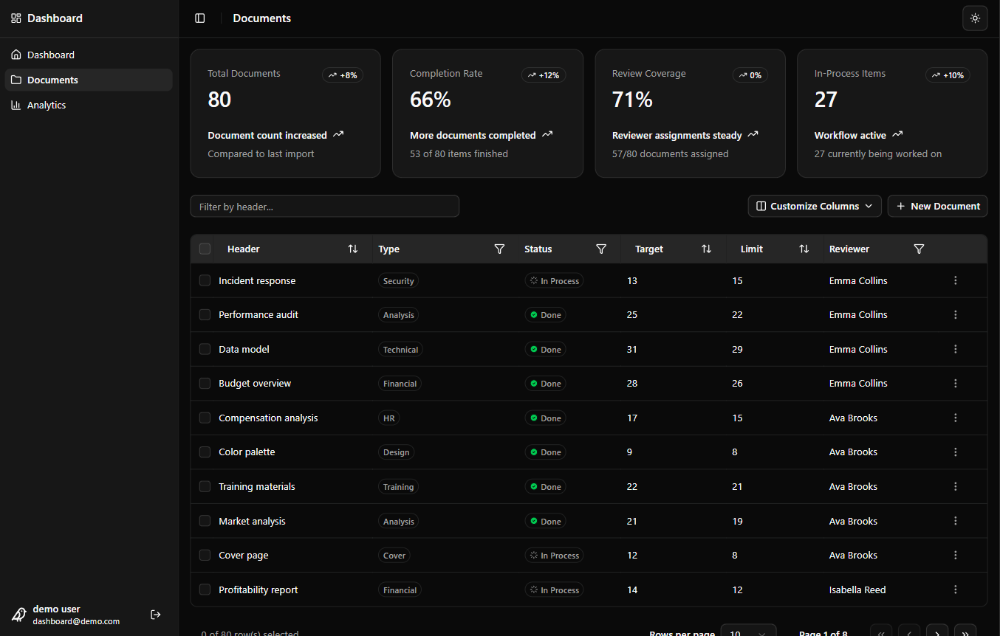

# Dashboard

A portfolio dashboard application built with React and TypeScript that demonstrates common production patterns including authenticated data access, CRUD operations, form validation, analytics visualizations, accessibility best practices, and testing, backed by Supabase.

## Stack

-   React + TypeScript (Vite)
-   React Router
-   TanStack Query & Table
-   React Hook Form
-   Tailwind CSS + shadcn/ui
-   Recharts
-   Supabase (PostgreSQL, Auth, RLS)
-   Vitest + React Testing Library

## Features

-   Authentication flow powered by Supabase
-   Analytics dashboard with interactive charts
-   Documents table with full CRUD
-   Form validation and error handling
-   Automated tests covering hooks, form and accessibility

## Live Demo

[👉 Try Dashboard](https://voice-o-sea.github.io/dashboard)

## Screenshots

&nbsp;&nbsp;&nbsp;&nbsp;&nbsp;
